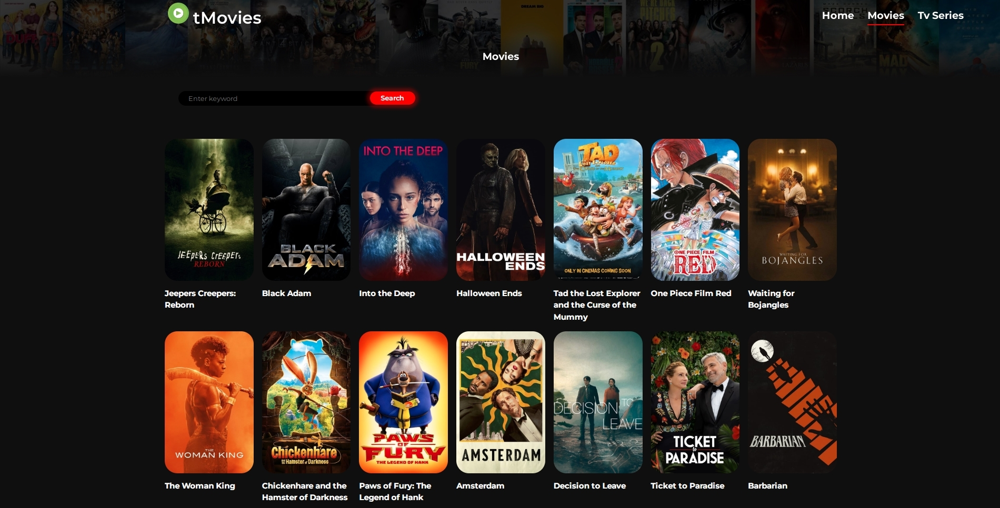
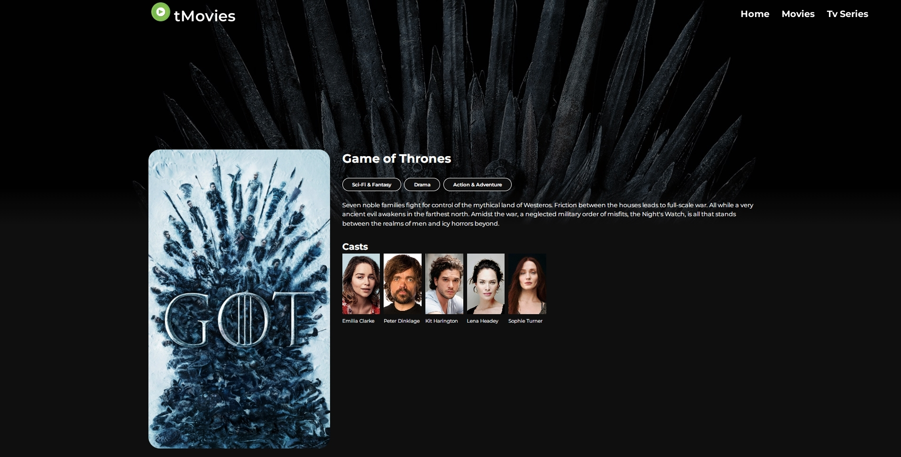

# React Movie Website

You can view this project [here](https://react-movie-website-app.netlify.app/).

## Built using:

Frontend:

- [React](https://reactjs.org)
- [Axios](https://axios-http.com)
- [Sass](https://sass-lang.com)
- [Swiper](https://swiperjs.com)
- [Movie API](https://www.themoviedb.org)

Deployment:

* [Netlify](https://www.netlify.com)

## Setup

- run `npm i && npm start`

## Getting Started

In the project directory, you can run:

### `npm start`

Runs the app in the development mode.\
Open [http://localhost:3000](http://localhost:3000) to view it in your browser.

The page will reload when you make changes.\
You may also see any lint errors in the console.
